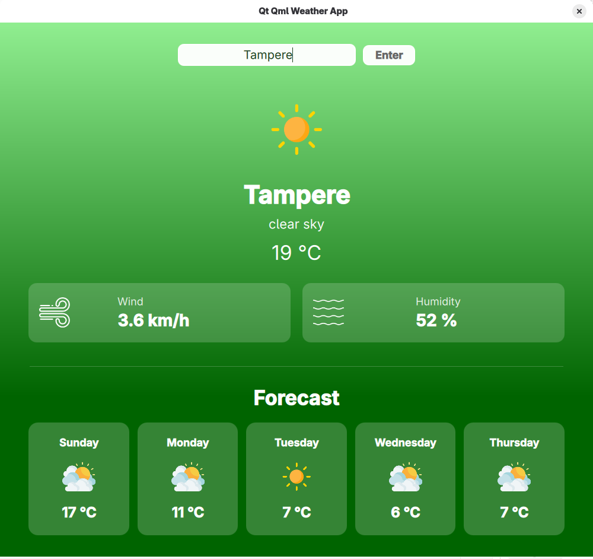
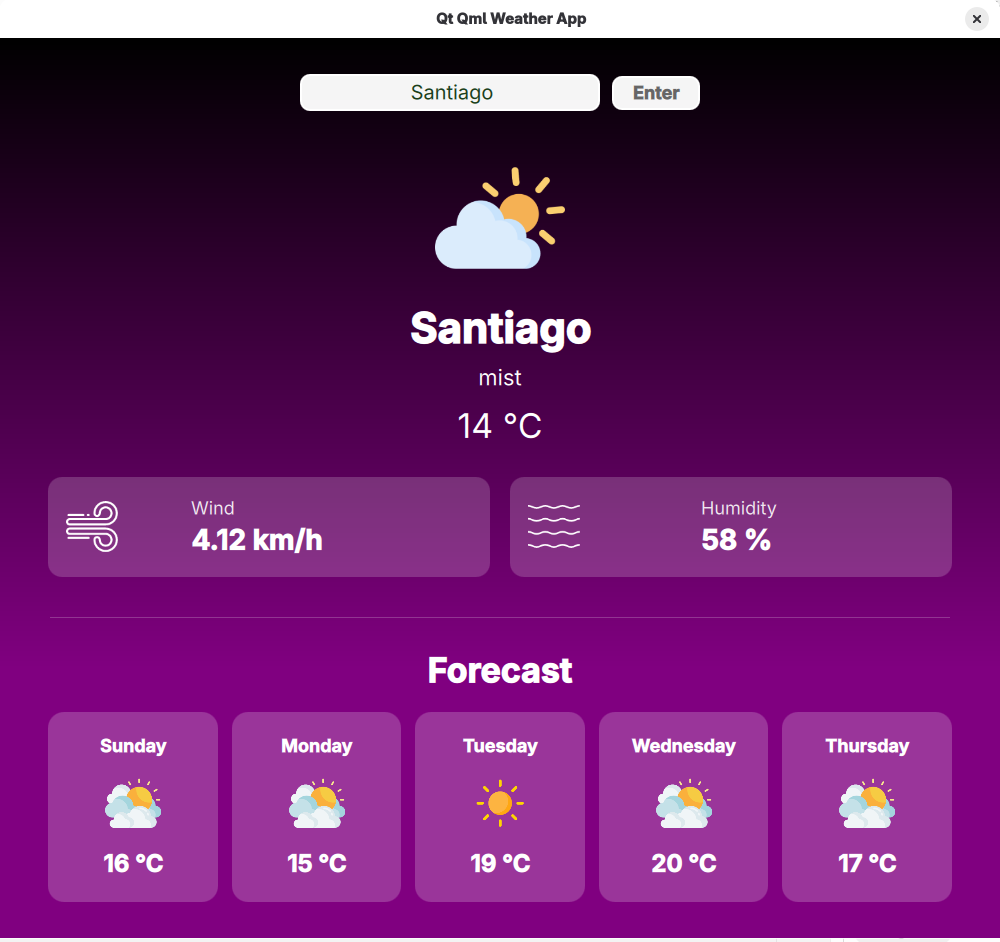
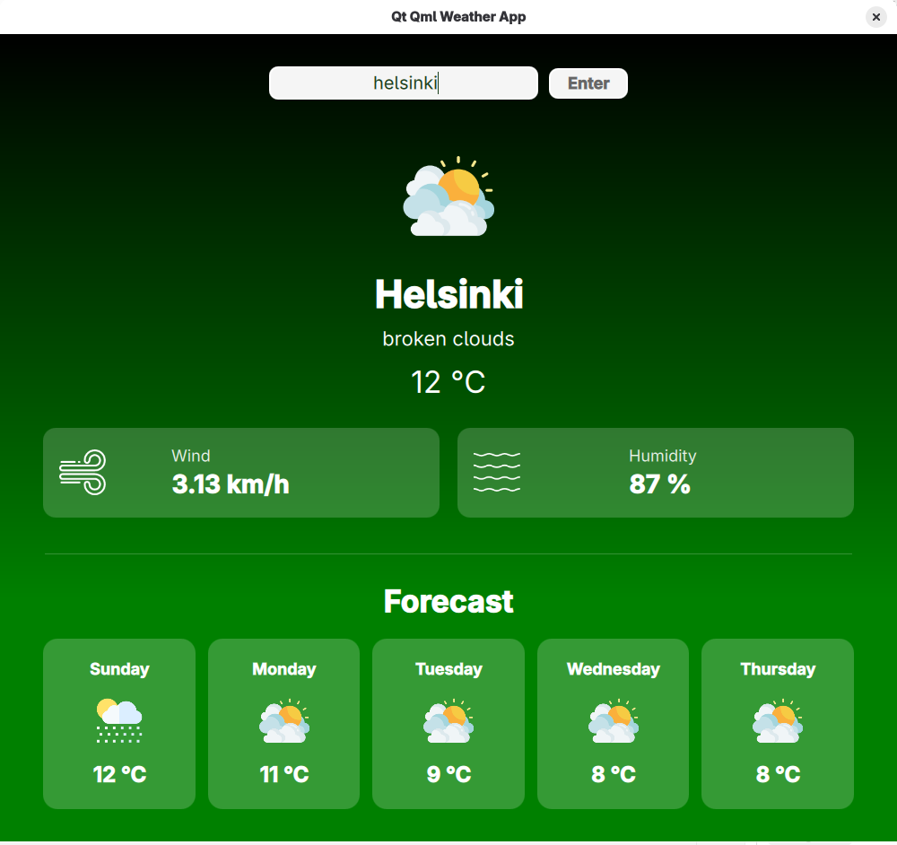
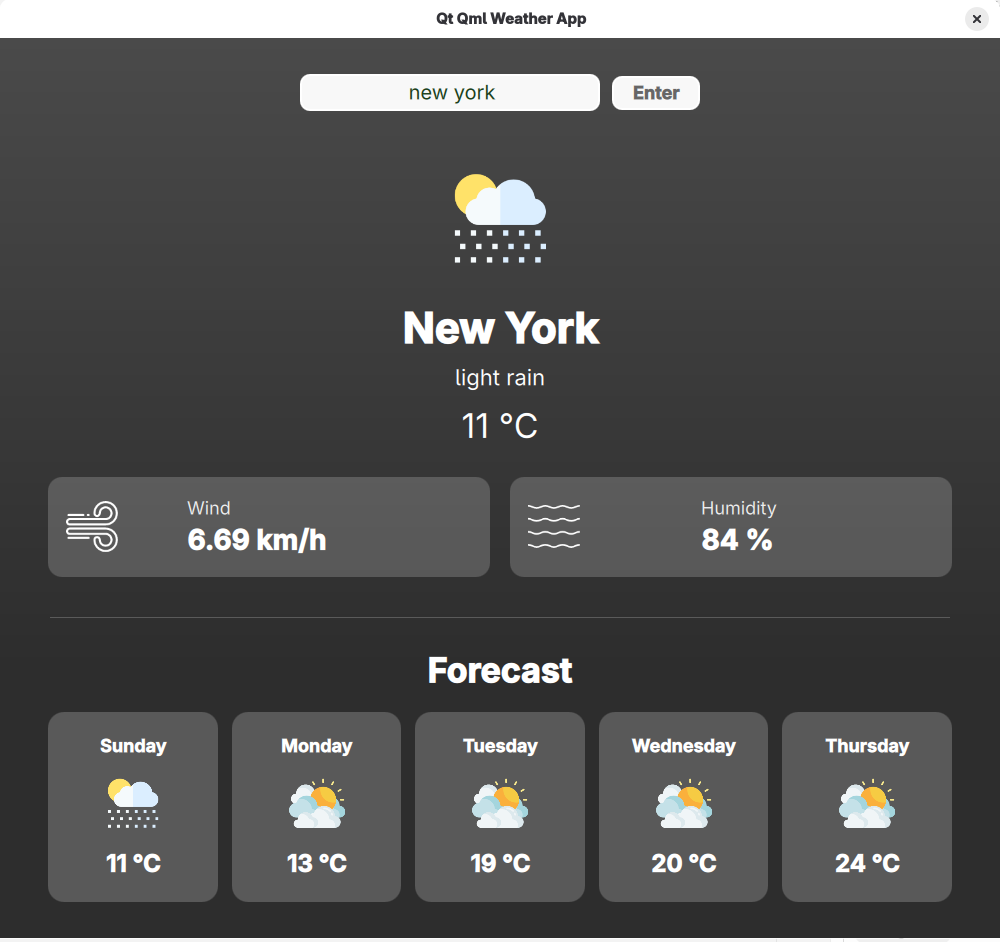

# Qt Qml Weather App

A desktop weather application built with **Qt 6**, **QML**, and **C++**. Search for any city, view current conditions (temperature, wind, humidity), and browse a 5-day forecast. The background gradient changes based on the weather.

## Screenshots

| Clear sky (Tampere) | Mist (Santiago) |
|:---:|:---:|
|  |  |

| Broken clouds (Helsinki) | Light rain (New York) |
|:---:|:---:|
|  |  |

## Features

- City search with live data from [OpenWeatherMap](https://openweathermap.org/api)
- Current weather: icon, description, temperature, wind speed, humidity
- 5-day forecast with daily icons and temperatures
- Dynamic UI colors that match the weather (clear, clouds, rain, snow, fog, and more)
- Built with Qt Quick Controls and responsive layouts

## Requirements

- **CMake** 3.21+
- **C++** compiler with C++17 support
- **Qt 6.2+** with modules:
  - Qt Core, Gui, Network, Qml, Quick, QuickControls2

On Fedora:

```bash
sudo dnf install qt6-qtbase-devel qt6-qtdeclarative-devel cmake gcc-c++
```

## Build & Run

```bash
git clone https://github.com/macar3420/Qt-Qml-Weather-App.git
cd Qt-Qml-Weather-App

cmake -B build -DCMAKE_BUILD_TYPE=Release
cmake --build build -j$(nproc)

./build/QtQmlWeatherApp
```

Run from the project root or the `build/` directory.

## OpenWeatherMap API Key

The app uses the OpenWeatherMap API. Replace the API key in `content/App.qml` (`fetchWeather` and `fetchData`) with your own key from [openweathermap.org](https://openweathermap.org/api).

## Project Structure

```
Qt-Qml-Weather-App/
├── content/           # Main UI (App.qml) and weather images
├── imports/           # QML module (QtQmlWeatherApp)
├── src/               # C++ entry point (main.cpp)
├── screenshots/       # App screenshots for documentation
├── CMakeLists.txt
└── QtQmlWeatherApp.qmlproject
```

## Tech Stack

- Qt 6 / QML / Qt Quick Controls 2
- CMake
- OpenWeatherMap REST API (`XMLHttpRequest`)

## License

Add your license here if applicable.
